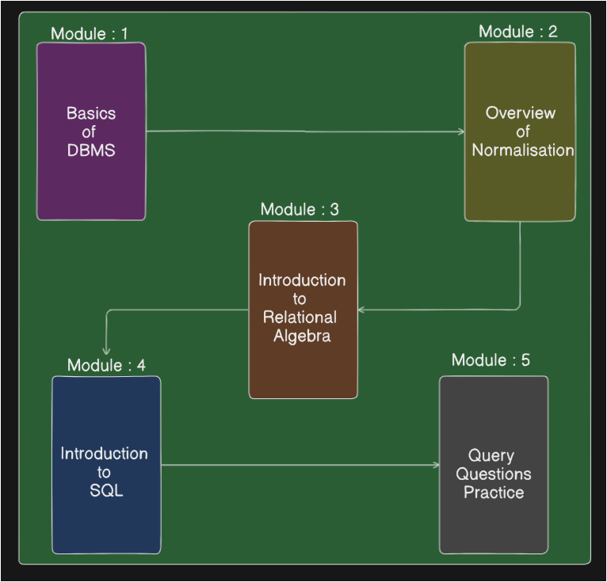

# What's a Database Anyway..?
[Date : 02-04-25]

### What we learn?
- [x] 1] SQL based DBMS
	- SQL simple to start learning data add & retrieve 

### What we next time?
- [x] 2] Overview of Normalisation
	- Normalisation is way of DBMS making better & fast.
- [x] 3] Introduction to Relational Algebra
	- Working of SQL with database.
- [x] 4] Introduction to SQL
- [x] 5] Query Questions Practice

### Motivational **Topics** :
- [x] Be always ready for opportunities 24x7.

 

---------------

 

### Conquer the SQL
- `DBMS` : Data Base Management System
	- We have multiple databases like MongoDB, Postgres, MySQL, Oracle...
- SQL is good learning as we start then we 

## SQL based DBMS 

- 

### What Database?
- Database is `storage area` in there store the data.
	- e.g. self as user, our kabard is => data & my partner is DBMS that manage my data.

- `DBMS`: Collection of **related data**, which is stored in a computer system to retrieve when required.

- `Data` :Raw & Unorganized facts
	- e.g. 12 PM => that data have no any other related facts i.e. unorganized
- `Information`: Data that has been processed, organanized & meaningful.
	- e.g. Today's class end at 12 PM.

 

> [!NOTE]
> - DBMS is not related to `SQL`.
> - `Query/Queries` : We require a language like SQL to add or remove data from a database.

> [!IMPORTANT]

 

-------

> [!TIP]
> Helpful advice for doing things better or more easily.

### Extra Work 
- [x]  

